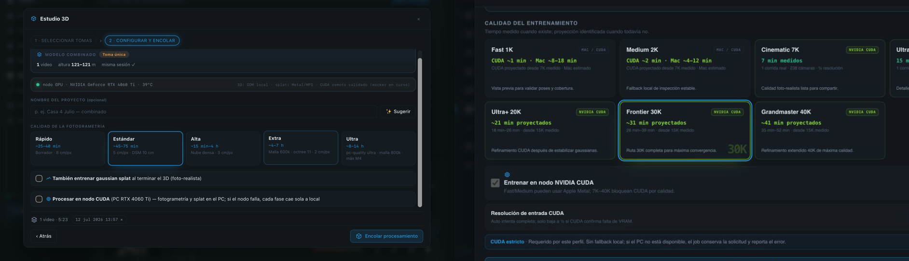
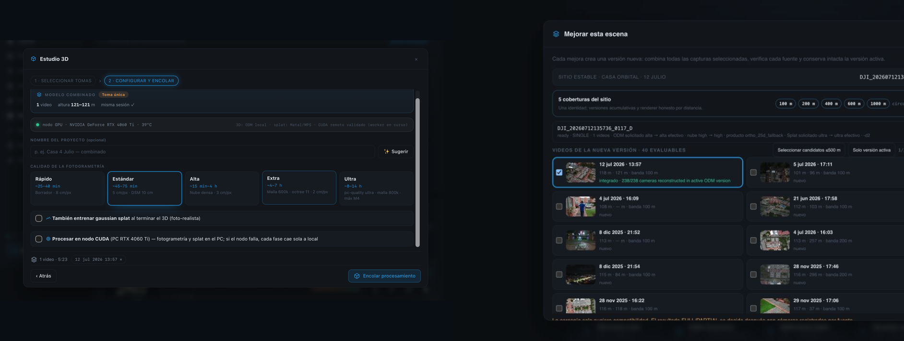

# Design QA — CUDA splat frontier UI

Date: 2026-07-13  
Reference: user-provided Estudio 3D configuration screenshot  
Implementation: `web/tresd.js`, `web/shell.js`, `web/style.css`

> Visual acceptance snapshot. Backend evidence advanced on 2026-07-14: Ultra+ 20K is now a
> measured CUDA run (`d1` OOM → `d2` success), and the gated 1,019-input ODM scene is published
> with browser QA. Frontier 30K is now measured at CUDA FULL `d1` with 3,236,419 Gaussians and
> browser QA. Grandmaster 40K also completed at CUDA FULL `d1` in one attempt, with 3,067,353
> source Gaussians, a 34,903,178-byte SOG and browser QA. Neither 30K nor 40K fell back to the Mac.

## Visual comparison

The implementation preserves the existing product language: dark modal shell, blue active
step, compact uppercase labels, restrained borders, monospace telemetry, the established
quality-card interaction, and the same primary action hierarchy. The new profile surface is
an extension of those components rather than a separate visual system.

## Deliberate product changes

- Replaced the stale “worker integration in progress” and silent Metal fallback promise with
  the live NVIDIA node state, VRAM, temperature, utilization, and strict failure policy.
- Added the complete canonical quality ladder: Fast 1K, Medium 2K, Cinematic 7K, Ultra 15K,
  Ultra+ 20K, Frontier 30K, and Grandmaster 40K.
- Kept local Apple Metal only for Fast/Medium. CUDA-only cards visibly lock the compute choice.
- Added measured-versus-projected timing language. Measured values include sample count,
  cameras, and effective resolution; projections identify their measured baseline and range.
- Added Auto/Complete/Half resolution controls with full-first behavior explained in place.
- Split ODM fallback behavior from splat behavior: ODM may continue locally; strict CUDA splats
  do not silently change backend or quality.
- Reframed reconstruction around a stable site instead of disposable jobs. The active version,
  immutable prior versions, all 40 evaluated videos, per-source altitude/evidence, and the 24-source
  processing cap are visible before submission.
- Added honest coverage products at 100/200/400/600/1000 m. A diameter is selectable only when the
  measured footprint can support it; circle and square modes report their exact area.
- Added a verified batch surface for Grandmaster 40K with per-target camera/input facts, node health,
  full-first/OOM-half policy, and a sequential queue estimate.

## Interaction QA

- Direct splat flow: all seven tiers render; Frontier 30K is selected; CUDA is locked; Auto is
  selected; strict policy is visible.
- Local fallback: selecting Fast 1K enables the compute toggle; disabling CUDA updates the
  policy to Apple Metal and disables CUDA resolution controls.
- Studio phased flow: enabling gaussian training reveals the same seven-tier contract and
  sends the same preset/backend/resolution vocabulary as the direct flow.
- Live node states cover ready, busy, asleep, and unavailable; asleep exposes Wake-on-LAN.
- Desktop visual pass completed in the in-app browser using real vault data and RTX telemetry.
- Grandmaster acceptance reran the full share/workspace/jobs matrix in mobile, iPad and desktop;
  all nine surfaces passed with the current 40K SOG and selected-run log history.
- Progressive-site modal: 40 evaluated videos, 1/24 selected, stable-site identity and all seven
  Gaussian tiers present; Frontier 30K selected and CUDA locked.
- CUDA campaign: 900 px dialog, no DOM horizontal overflow, seven eligible targets, RTX 4060 Ti
  verified, and a 4.8 h sequential estimate.
- Mundo: seven islands with the stable site rendered once; 100/200/400 m enabled and 600/1000 m
  disabled as pending; carousel arrows do not overlap the site title.
- Volar: 100 m square enforces a 10,000 m² product boundary at 60 fps with no console errors.

## Current captures

- [CUDA campaign](docs/qa/2026-07-13-cuda-campaign-v183.png)
- [Progressive site](docs/qa/2026-07-13-progressive-site-v183.png)
- [Mundo site products](docs/qa/2026-07-13-mundo-sites-v183.png)
- [100 m square flight](docs/qa/2026-07-13-volar-100m-square-v183.png)

## Result

PASS. No blocking hierarchy, spacing, contrast, overflow, console, or interaction defects remain
in the tested desktop DOM. Responsive rules collapse the profile grid to two columns below 900 px
and one column below 580 px.
